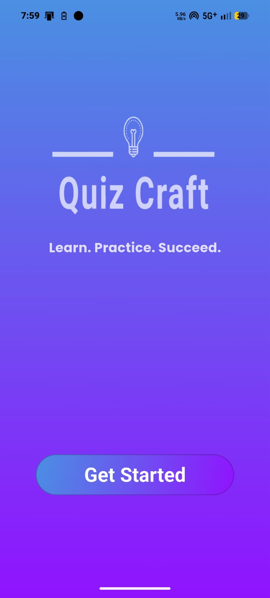
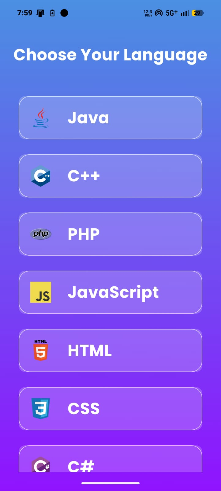
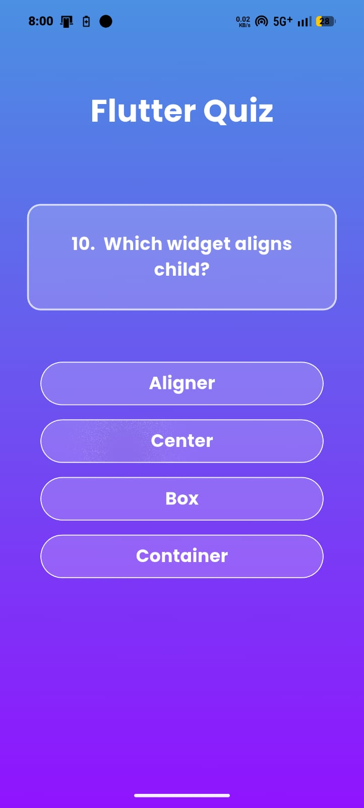
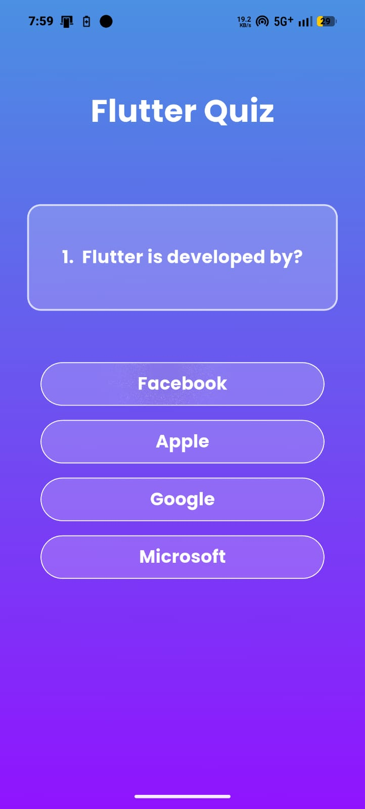
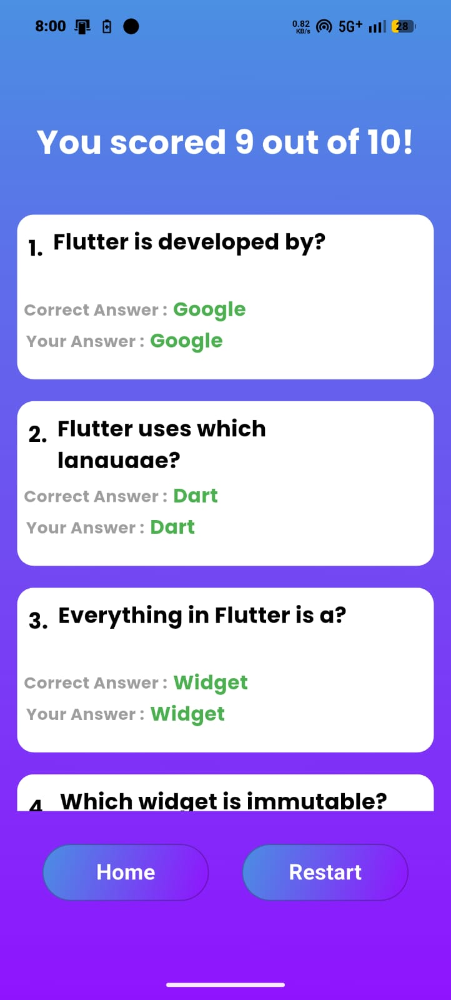

# QuizCraft 🎯

[](https://github.com/PritamSapkal/QuizeCraft/releases/tag/v1.0.0)
[](https://github.com/PritamSapkal/QuizeCraft/stargazers)

> **Learn. Practice. Succeed.**

QuizCraft is an interactive quiz application built using Flutter. Designed for students and beginners in IT and application development, it offers a focused environment to practice and evaluate programming and web technology skills.

---

## 📌 About the Project

QuizCraft was built to explore core mobile application architecture in Flutter, focusing on multi-screen navigation, sequential state handling, and score evaluation logic. It provides instant interactive assessments without requiring internet connectivity or external accounts.

---

## 🖼️ Application Showcase

| Start Screen | Home / Category Selection | Quiz Screen |
|:---:|:---:|:---:|
|  |  |  |

| Active Question | Result & Evaluation |
|:---:|:---:|
|  |  |

---

## ✨ Features

- **Categorized Question Sets:** Covers key programming languages and web foundations:
  - **Programming Languages:** Java, Python, C, C#, .NET, PHP
  - **Web Technologies:** HTML, CSS, JavaScript
- **Multiple-Choice Format:** Standard 4-option questions with automatic navigation to the next question upon selection.
- **Detailed Result Breakdown:**
  - Displays total score tally (e.g., 5/10).
  - Post-assessment review showing questions, user choices, and correct solutions.
  - Color-coded feedback (green for correct, red for incorrect).
- **Navigation Controls:** Direct options to restart the current quiz or return to the main language selection list.

---

## 🧭 Application Workflow

1. **Start Screen:** Onboarding screen with direct entry point into the application.
2. **Category Selection:** Scrollable list displaying available programming and web tracks.
3. **Active Quiz:** Sequentially renders questions, records user choices, and advances automatically.
4. **Result Screen:** Evaluates responses and displays detailed score metrics alongside correct answers.
5. **Post-Quiz Actions:** Users can retry the quiz immediately or navigate back to the home category feed.

---

## 🛠️️ Tech Stack & Tools

- **Framework:** Flutter
- **Language:** Dart
- **IDE:** Android Studio / VS Code
- **Platform:** Android

---

## 🚀 Getting Started

### Prerequisites

- [Flutter SDK](https://docs.flutter.dev/get-started/install) (stable channel)
- Android Studio or VS Code with Flutter extension
- Android emulator or physical device

### Installation & Run

1. **Clone the repository:**
   ```bash
   git clone [https://github.com/PritamSapkal/QuizeCraft.git](https://github.com/PritamSapkal/QuizeCraft.git)
   cd QuizeCraft
